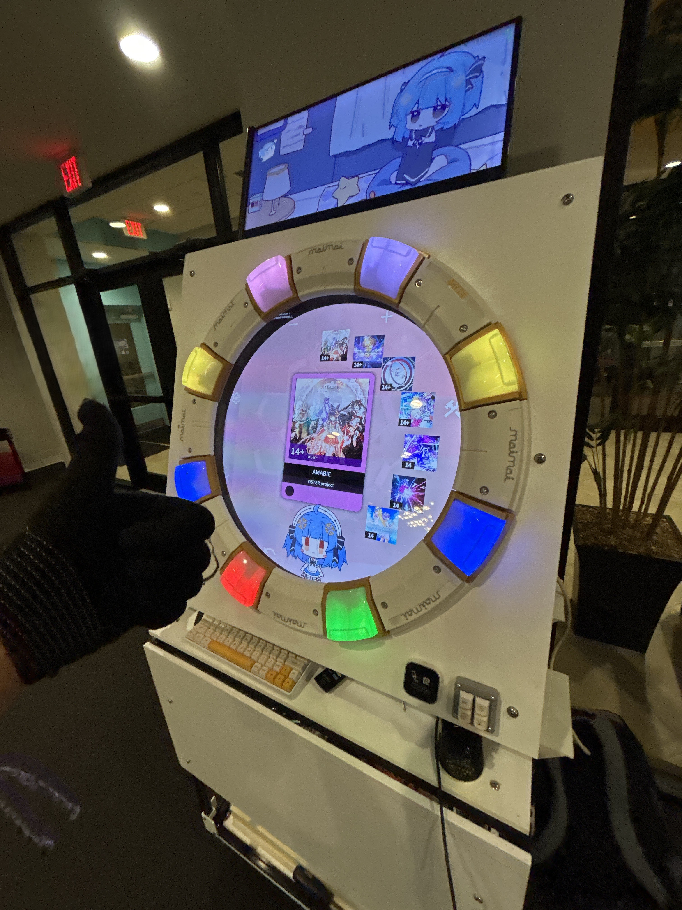
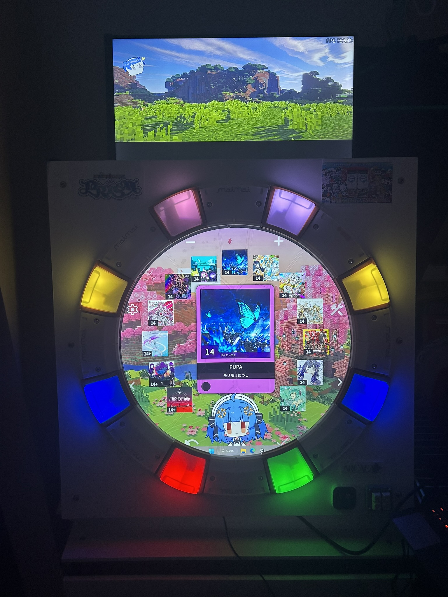

# Maimai Controller Fullsize

A fullsize homemade maimai machine.
This guide is not finished yet, but most of the files you need to make the machine are here.

# Disclaimers

Read [Romper's fullsize guide](https://github.com/ir0nq/maimai-homemade-controller) before reading the instructions here.

I am NOT financially responsible for any mishaps you might have. This is only a guide. Double check all measurements.

# License

CC-NC, feel free to modify the project but don't make any money from this guide.

# Bill of Materials

## PCB

- Raspberry Pi Nano
- USB C Connector
- 5.1k ohm resistor 0603
- 1uF capacitor 0603
- MPR121 Modules
- Dupont Pin headers
- JST XH 3 Pin connectors, headers
- 50m red wire
- 20m yellow wire
- 20m black wire
- SN74LV1T34DBVR Level shifter
- WS2812B RGB LED
- Mai pico IO PCB x1
- Syndric's RGB PCB x8

## Main Build

- Rabbit buttons
- ITO Film 40ohm 1m
- 43" TV
- 24" side-to-side Octagon glass
- Chair leg floor protectors
- 2020 48" Aluminum
- Small wood screws for buttons
- Wood screws for mai spacers
- Appropriate spacers

# Tools Needed

- Flathead screwdriver
- Philips screwdriver
- 3D printer
- Router
- Miter saw
- PPE
